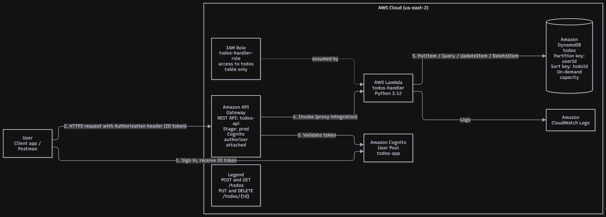

**Serverless To-Do REST API with Cognito, API Gateway, Lambda and DynamoDB** | AWS 2: Becoming a Solutions Architect, Project 3

**Note**: This project was built in the AWS Management Console in **us-east-2**. The Lambda code is in [`lambda/lambda_function.py`](./lambda/lambda_function.py).

## Table of Content

- [Solution Overview](#solution-overview)
- [Architecture Diagram](#architecture-diagram)
- [AWS Services Used](#aws-services-used)
- [Deploying the Solution](#deploying-the-solution)
  - [Prerequisites](#prerequisites)
    - [1. Create the DynamoDB table](#1-create-the-dynamodb-table)
    - [2. Create the Lambda function](#2-create-the-lambda-function)
    - [3. Add the IAM policy](#3-add-the-iam-policy)
    - [4. Create the API Gateway API](#4-create-the-api-gateway-api)
    - [5. Create the Cognito user pool](#5-create-the-cognito-user-pool)
    - [6. Attach the authorizer and deploy](#6-attach-the-authorizer-and-deploy)
- [API Reference](#api-reference)
- [Testing the Solution](#testing-the-solution)
- [Security](#security)
- [Cost](#cost)
- [Not Implemented](#not-implemented)
- [Cleanup](#cleanup)
- [Author](#author)
- [License](#license)

# Solution Overview

This solution is a serverless REST API where signed-in users create, list, update and delete their own to-do items. It uses [Amazon API Gateway](https://aws.amazon.com/api-gateway/) as the HTTPS entry point, [Amazon Cognito](https://aws.amazon.com/cognito/) for sign-up, sign-in and token-based authentication, [AWS Lambda](https://aws.amazon.com/lambda/) for the application logic, and [Amazon DynamoDB](https://aws.amazon.com/dynamodb/) for storage.

There are no servers, VPCs or NAT Gateways to manage. Each user can only read and change their own items, because the Lambda function uses the user ID from the Cognito token as the DynamoDB partition key.

# Architecture Diagram

**Request flow**

1. The user signs in to the Cognito user pool and receives an ID token.
2. The client sends an HTTPS request to API Gateway with the ID token in the `Authorization` header.
3. API Gateway validates the token with the Cognito authorizer. Requests without a valid token get `401 Unauthorized`.
4. API Gateway invokes the Lambda function through Lambda proxy integration.
5. Lambda reads the user ID from the token's `sub` claim and reads or writes that user's items in DynamoDB.
6. Lambda writes logs to Amazon CloudWatch Logs.

# AWS Services Used

| Service | Resource | Why |
|---|---|---|
| Amazon API Gateway (REST) | `todos-api`, stage `prod` | Public HTTPS entry point, routing, and Cognito authorizer integration |
| Amazon Cognito user pool | `todos-app` | Sign-up, sign-in and ID tokens, without building an auth system |
| AWS Lambda (Python 3.12) | `todos-handler` | One function handles all create, list, update and delete operations |
| Amazon DynamoDB | `todos` (partition key `userId`, sort key `todoId`, on-demand) | Key-value access by user, no capacity planning |
| AWS IAM | `todos-handler` execution role | Least-privilege access from Lambda to the table |
| Amazon CloudWatch Logs | Lambda log group | Debugging and audit of invocations |

# Deploying the Solution

## Prerequisites

- An AWS account
- Use one region for every service (this project uses **us-east-2**)
- [Postman](https://www.postman.com/) or `curl` for testing

### 1. Create the DynamoDB table

1. Open DynamoDB, then **Create table**.
2. Table name `todos`, partition key `userId` (String), sort key `todoId` (String).
3. Under **Table settings**, choose **Customize settings** and set capacity mode to **On-demand**.
4. Click **Create table** and wait for the status to show **Active**.

### 2. Create the Lambda function

1. Open Lambda, then **Create function**, then **Author from scratch**.
2. Function name `todos-handler`, runtime **Python 3.12**, default execution role.
3. Paste the contents of `lambda/lambda_function.py` into the code editor and click **Deploy**.

### 3. Add the IAM policy

1. Open the function's execution role in IAM and add an inline policy named `todos-table-access`.
2. Allow `dynamodb:PutItem`, `GetItem`, `UpdateItem`, `DeleteItem` and `Query` on the `todos` table ARN only.

### 4. Create the API Gateway API

1. Create a **Regional REST API** named `todos-api`.
2. Create the resource `/todos` with methods **POST** and **GET**.
3. Create the resource `/todos/{id}` with methods **PUT** and **DELETE**.
4. For every method, use **Lambda function** integration with **Lambda proxy integration** turned on and response transfer mode **Buffered**, pointing at `todos-handler`.

### 5. Create the Cognito user pool

1. Create a user pool with email as the sign-in identifier and a single-page-application app client (`todos-app`) with **no client secret**.
2. On the app client, enable `ALLOW_USER_PASSWORD_AUTH`.
3. Create a test user with a permanent password.

### 6. Attach the authorizer and deploy

1. In `todos-api`, create a **Cognito** authorizer `todos-cognito` using the user pool, with token source `Authorization`.
2. For all four methods, open **Method request** and set **Authorization** to `todos-cognito`.
3. Click **Deploy API** and deploy to a new stage named `prod`.
4. Copy the **Invoke URL** from the stage page.

# API Reference

All routes require the Cognito ID token in the `Authorization` header (no `Bearer` prefix).

| Method | Path | Description | Success |
|---|---|---|---|
| POST | `/todos` | Create a todo. Body: `{"title": "..."}` | 201 |
| GET | `/todos` | List the caller's todos | 200 |
| PUT | `/todos/{id}` | Update a todo. Body: `{"title": "...", "done": true}` | 200 |
| DELETE | `/todos/{id}` | Delete a todo | 200 |

Updating or deleting an item that does not exist returns `404 {"error": "Todo not found"}`.

# Testing the Solution

Tested with Postman against the `prod` stage, using a Cognito ID token for the test user.

| Test | Expected result | Screenshot |
|---|---|---|
| Call `/todos` with no token | 401 `Unauthorized` | `screenshots/01-unauthorized.png` |
| POST `/todos` | 201 with a `todoId` | `screenshots/02-post-201.png` |
| GET `/todos` | 200 with the user's todos | `screenshots/03-get-200.png` |
| PUT `/todos/{id}` | 200 with `"done": true` | `screenshots/04-put-200.png` |
| DELETE `/todos/{id}` | 200 with `{"deleted": "<id>"}` | `screenshots/05-delete-200.png` |
| DELETE the same id again | 404 `Todo not found` | `screenshots/06-delete-404.png` |

Console screenshots: DynamoDB table (`screenshots/07-dynamodb.png`), IAM inline policy (`screenshots/08-iam-policy.png`), Cognito user pool and app client (`screenshots/09-cognito.png`), API Gateway resources and authorizer (`screenshots/10-api-gateway.png`).

# Security

- **Authentication:** every method uses a Cognito authorizer, so unauthenticated requests never reach Lambda.
- **Per-user isolation:** the token's `sub` claim is the DynamoDB partition key, so a user can only access their own items.
- **Least privilege:** the inline IAM policy limits Lambda to five DynamoDB actions on one table. The role also has the basic Lambda logging permission.
- **No client secret:** the app client is a public client, which suits browser and Postman use.
- **Test-only settings:** `ALLOW_USER_PASSWORD_AUTH`, the implicit grant and the `https://example.com` callback URL were enabled to obtain test tokens. Remove them in a real deployment.
- **Known limitation:** Lambda responses set `Access-Control-Allow-Origin: *`. A production system should restrict this to the real frontend origin.
- ID tokens expire after 60 minutes.

# Cost

All services are pay-per-use: DynamoDB on-demand, Lambda per invocation, API Gateway per request, and Cognito per monthly active user. At demo volume the cost is expected to be minimal (check current AWS pricing and free-tier terms). There are no servers, VPCs or NAT Gateways, which are the usual fixed-cost items.

# Not Implemented

Out of scope for this project: AWS WAF rate limiting, a CloudFront and S3 frontend, X-Ray tracing, API Gateway caching and DynamoDB Streams.

# Cleanup

After grading, delete the API Gateway API, the Lambda function and its log group, the DynamoDB table, the Cognito user pool (including the test user), and the IAM inline policy and role.

# Author

Mira Emad

# License

Add a license here if you want one, for example MIT.
